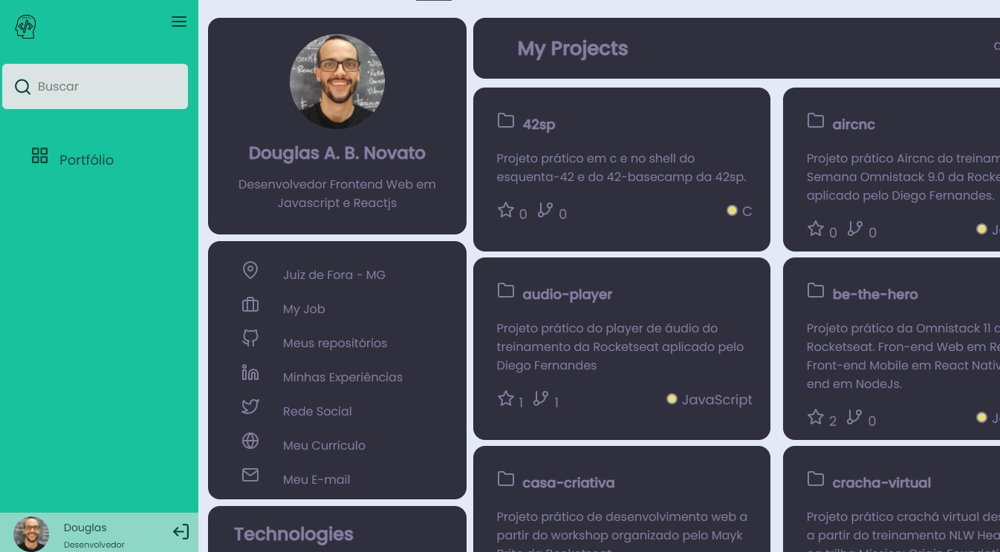
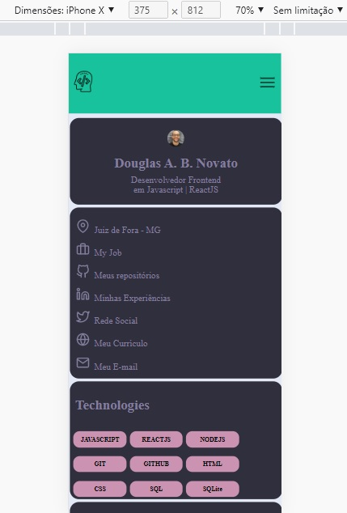
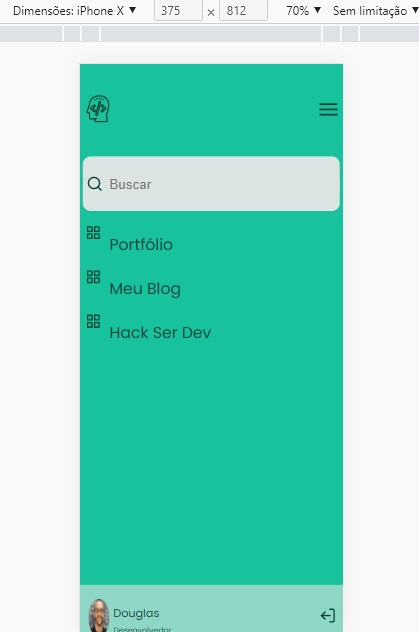
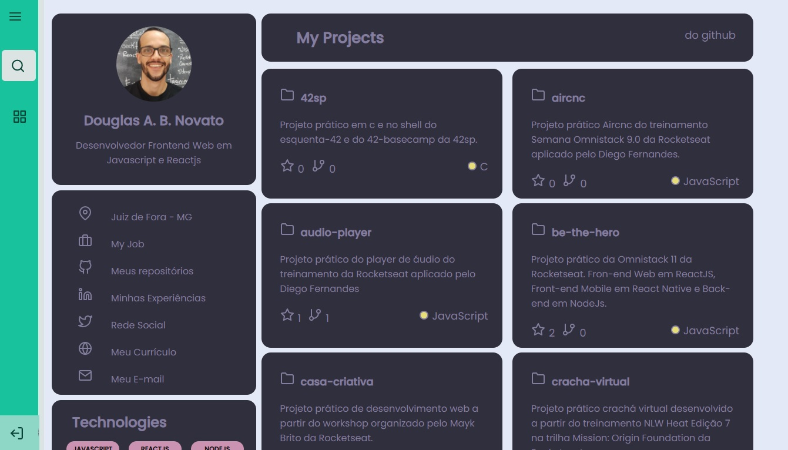
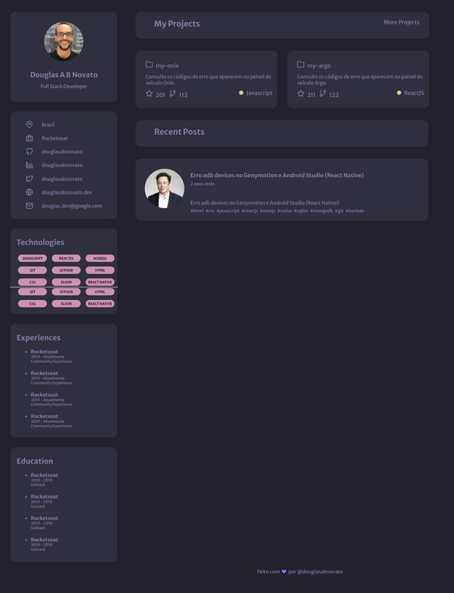
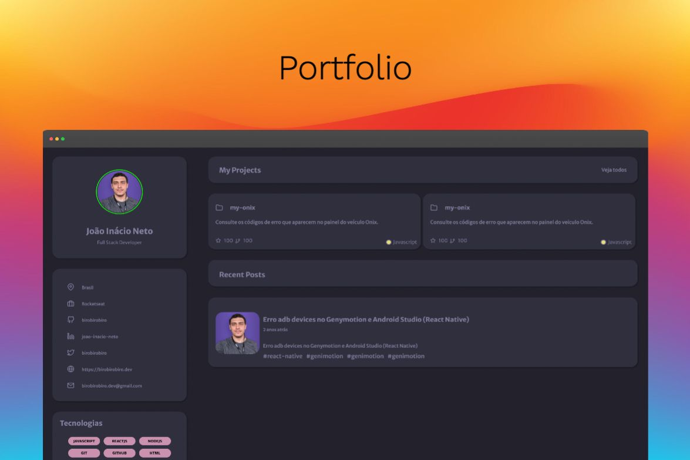
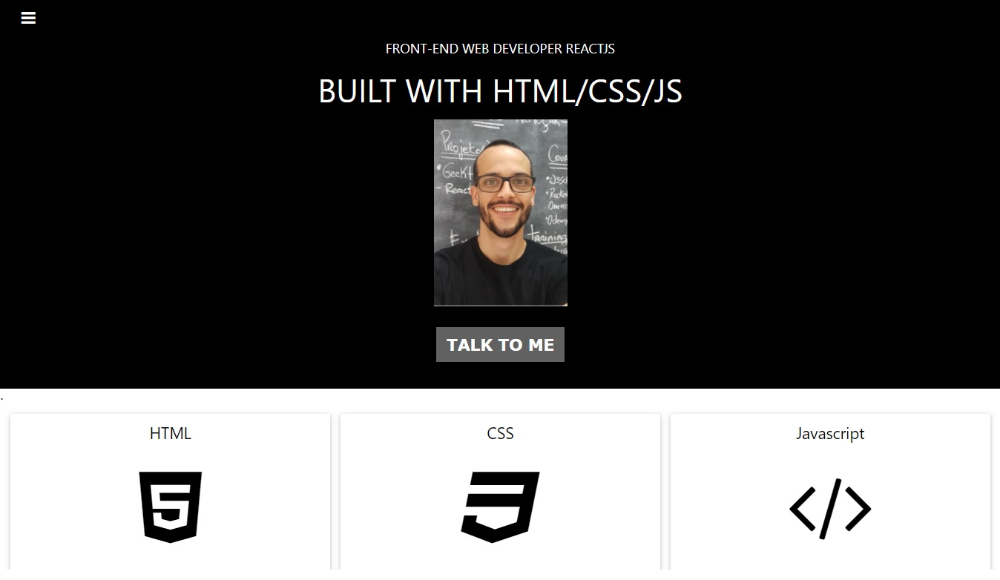
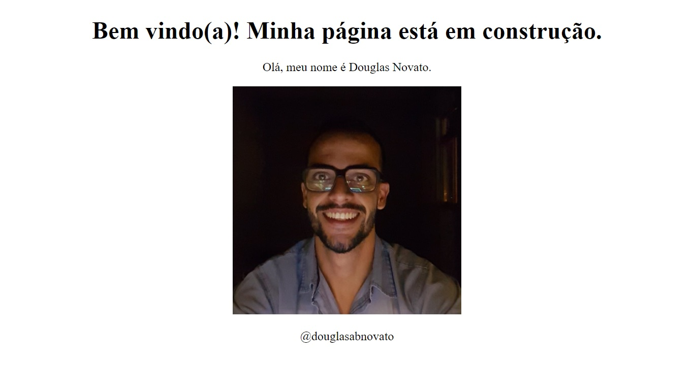

<h1 align="center">
    
</h1>

<h4 align="center"> 
	🚧 douglasabnovato.dev 🚀
</h4> 

<p align="center">
  
  
  <a href="https://www.twitter.com/douglasabnovato/">
    
  </a>
</p>

## 💻 Sobre o projeto

♻️ douglasabnovato.dev

Uma página para demonstrar meus projeto de código e artigos.
Também uma sugestão de conteúdos da internet, organizados de forma progressiva.

1. Meu portfólio: com os repositórios do github
2. Meu blog - com os artigos do medium
3. Hack Ser Dev - uma timeline de conteúdo e rotina para dev

A gestão das tarefas para completar esse projeto está no "Project Board" desse repositório.
Onde tem a descrição de tudo o que esse projeto se propõe a ter quando terminado.

O desenvolvimento foi organizado em branches. Dessa forma, a versão mais atualizada está na master, versões anteriores possuem suas respectivas versões em branches nomeadas.

## 🎨 Versões Layout

Criar uma aplicação com a url igual ao do perfil para ser meu portfólio.

### Próximo Passo

- [ ] Acessibilidade: pesquisar elementos para mobile e desktop

### Web - v4.1: 

Nessa versão, o objetivo é explorar ainda mais a Responsividade.
Aperfeiçoar os pontos de transição e a usabilidade conforme o dispositivo que está sendo utilizado.

Referências 
- [ ] [web.dev / Learn Responsive Design](https://web.dev/learn/design/):
- [ ] macro layouts
- [ ] micro layouts
- [ ] typography
- [ ] images
- [ ] picture
- [ ] icon
- [ ] theming
- [ ] accessibility
- [ ] interation
- [ ] user interface patterns
- [ ] media features
- [ ] screen configuration

### Web - v4.0: 

- Versão com mais adaptabilidade na versão desktop e uma versão mobile.

<p align="center" style="display: flex; align-items: flex-start; justify-content: center;">
  
  
</p> 

Referências
- [x] [mobile first](https://www.moblee.com.br/blog/mobile-first-principais-vantagens/): pesquisa 
- [x] [conteúdo de responsividade](https://web.dev/learn/design/):
- [x] media queries
- [x] internationalization
- [x] macro layouts: flexbox e grid
- [x] [layout fluído com css](https://dev.to/kathryngrayson/you-probably-dont-need-media-queries-anymore-a4j?signin=true)

Etapas
- [x] portfólio: alterado as unidades de medidas de fixas para as fluídas: de px para %, vw, vh, rem, auto
- [x] sidebar: alterado as unidades de medidas de fixas para as fluídas: de px para %, vw, vh, rem, auto
- [x] verificar o comportamento em desktop
- [x] verificar o comportamento em tablet
- [x] tags HTML semânticas
- [x] usando media queries: 420px para mobile
- [x] sidebar no topo com movimento da home alinhado
- [x] home left vir logo abaixo da sidebar 
- [x] home right vir logo abaixo da home left

### Web - v3.5: 

Aperfeiçoar em forma de site com uma sidebar onde o primeiro item do menu sendo a home contendo o portfólio.

<p align="center" style="display: flex; align-items: flex-start; justify-content: center;">
  
  
</p> 

- [x] implementar o desafio portfólio como a página home com a estrutura do desafio sidebar.

### Web - v3.4: 

- [x] Tornar os cards dos projetos clicáveis com infos da api: issue #1 (sem branch)

### Web - v3.3:
Aperfeiçoar a aplicação acrescentando dinamismo.

<p align="center" style="display: flex; align-items: flex-start; justify-content: center;">
  
</p> 

- [x] estudar as referências indicadas

## 🛠 Buscas no Google

- [como modificar atributos, classes e styles na DOM](https://www.digitalocean.com/community/tutorials/how-to-modify-attributes-classes-and-styles-in-the-dom)
- [como consumir os repositorios da api github ](https://api.github.com/users/douglasabnovato/repos)
- [como fazer merge entre duas branches no git ](https://git-scm.com/book/pt-br/v2/Branches-no-Git-O-b%C3%A1sico-de-Ramifica%C3%A7%C3%A3o-Branch-e-Mesclagem-Merge)
- [como centralizar horizontalmente com justify-content: space-between](https://www.w3schools.com/css/tryit.asp?filename=trycss3_flexbox_justify-content_space-between)
- [como centralizar verticalmente ](https://www.w3schools.com/howto/howto_css_center-vertical.asp)
- [como centralizar vertical e horizontalmente](https://www.w3.org/Style/Examples/007/center.pt_BR.html#:~:text=Centrar%20linhas%20de%20textos,-Centrar%20textos%20de&text=Todas%20as%20linhas%20desse%20par%C3%A1grafo,CSS%20'text%2Dalign')
- [como posicionar elementos CSS - display: flex ](https://origamid.com/projetos/flexbox-guia-completo/)
- [como criar avatar com imagens ](https://www.w3schools.com/howto/howto_css_image_avatar.asp)
- [ como estilizar SVG com CSS](https://willianjusten.com.br/estilizando-svg-com-css-parte-1)
- [como estilizar o segundo elemento child :nth-child()](https://developer.mozilla.org/en-US/docs/Web/CSS/:nth-child)
- [como inserir icone svg](https://www.alura.com.br/artigos/como-utilizar-icones-em-paginas-web)
- [como estilizar um  tooltip](http://www.w3bai.com/pt/css/css_tooltip.html)
- [como estilizar boxes com cantos arredondados e sombras](https://www.w3.org/Style/Examples/007/roundshadow.pt_BR.html)
- [Como remover as bolinhas de uma lista não ordenada](https://www.demorodavel.com/como-remover-as-bolinhas-de-uma-lista-nao-ordenada/)
- [criar, gerir e automatizar quadros de projeto GitHub](https://docs.github.com/pt/issues/organizing-your-work-with-project-boards/managing-project-boards/about-project-boards)

#### 🚀 Se desafie também 

- [x] Consumir a API do Github: name, description, stargazers_count, forks_count,language
- [x] Ajustar o layout com os dados vindos da API  

### Web - v3.2

Aperfeiçoar a aplicação tornando os cards clicáveis

#### 🚀 Requisitos para o desafio

- [x] Os cards dos projetos deverão ser clicáveis
- [x] Os cards dos posts deverão ser clicláveis

### Web - v3.1

Aperfeiçoando a aplicação acrescentando dados estáticos para os links das redes sociais.

### Web - v3.0

Neste desafio devo criar uma página web para que seja meu portfolio e currículo. Utilizando HTML e CSS.

<p align="center" style="display: flex; align-items: flex-start; justify-content: center;">
  
</p>  

Layout descritivo no figma

<p align="center" style="display: flex; align-items: flex-start; justify-content: center;"> 
  
  
</p>  

- 💡 Como começar:</br> 
1 - Use o link do Figma como base para o projeto.</br> 
2 - Todas as imagens e ícones estão na pasta assets.</br> 
3 - Techs: HTML e CSS.</br> 
4 - Informações estáticas

#### 🎨 Style Guide
- Cores
````css
  :root {
    --body-bg-color: #22212C;
    --text-color: #837E9F;
    --bg-cards: #302F3D;
    --bg-techs: #CB92B1;
  }
````
- Tipo de fonte: font-family: Merriweather Sans, font-weight: 400, 500 e 700. Você pode encontrar a fonte no [Google Fonts](https://fonts.google.com/specimen/Merriweather+Sans?query=Merriweather+Sans)

### Web - v2.0

Utilizando um template do wschools para aperfeiçoar o layout da aplicação.
<p align="center" style="display: flex; align-items: flex-start; justify-content: center;">
  
</p>   

### Web - v1.0

Uma estrutura simples em html com um avatar e algumas informações.
Realizado os principais comandos de git para testar o fluxo de trabalho com esse código.

- github, git, github pages, repositório, página simples
- transformar essa página em uma página pessoal: `douglasabnovato.github.io`, somente arquivos estáticos 
- alterar o nome do repositório remoto e do local: `git remote remove origin`: `git@github.com:douglasabnovato/nome-repositorio.github.io.git`

<p align="center" style="display: flex; align-items: flex-start; justify-content: center;">
  
</p>  

## 🛠 Tecnologias

As seguintes ferramentas foram usadas na construção do projeto:
- [Css](https://developer.mozilla.org/en-US/docs/Web/CSS)
- [Javascript](https://developer.mozilla.org/en-US/docs/Web/JavaScript)
- [HTML](https://developer.mozilla.org/en-US/docs/Web/HTML)
- [Git](https://git-scm.com/doc)
- [Github](https://docs.github.com/en ) 
- [Github Pages](https://pages.github.com/)</br>

Referências de conteúdo para construir esse projeto

<p align="center" style="display: flex; align-items: flex-start; justify-content: center;"> 
  
</p> 

Segue os links correspondentes para colaborar na construção do desafio.

- [O guia estelar de HTML](https://app.rocketseat.com.br/node/o-guia-estelar-de-html)
- [O guia estelar de CSS](https://app.rocketseat.com.br/node/o-guia-estelar-de-css)
- [Posicionando foguetes](https://app.rocketseat.com.br/node/posicionando-foguetes)
- [Formulários de outro planeta](https://app.rocketseat.com.br/node/formularios-de-outro-planeta)
- [Alinhando os planetas](https://app.rocketseat.com.br/node/flexbox)
- [App bonito, até nos textos](https://app.rocketseat.com.br/node/flexbox)

## 🚀 Como executar o projeto

Podemos considerar este projeto como sendo com uma parte:
1. Front End (pasta web)  

### Pré-requisitos

Antes de começar, você vai precisar ter instalado em sua máquina as seguintes ferramentas:
[Git](https://git-scm.com), [Node.js][nodejs]. Além disso, é bom ter um editor para trabalhar com o código como [VSCode][vscode].

### 🧭 Rodando a aplicação web (Front End)

```bash 
# Clone este repositório
$ git clone https://github.com/douglasabnovato/douglasabnovato.dev
# Acesse a pasta do projeto no seu terminal/cmd
$ cd douglasabnovato.dev 
# Execute a aplicação em modo de desenvolvimento
Open Live Server
# A aplicação será aberta na porta:3000 - acesse http://localhost:3000
```

## 😯 Como contribuir para o projeto

1. Faça um **fork** do projeto.
2. Crie uma nova branch com as suas alterações: `git checkout -b my-feature`
3. Salve as alterações e crie uma mensagem de commit contando o que você fez: `git commit -m "feature: My new feature"`
4. Envie as suas alterações: `git push origin my-feature`
> Caso tenha alguma dúvida confira este [guia de como contribuir no GitHub](https://github.com/firstcontributions/first-contributions)

## :memo: Licença

Esse projeto está sob a licença MIT. Veja o arquivo [LICENSE](.github/LICENSE.md) para mais detalhes.

---  

Feito com ❤️ por Douglas A B Novato 👋🏽 [Entre em contato!](https://www.linkedin.com/in/douglasabnovato/)
