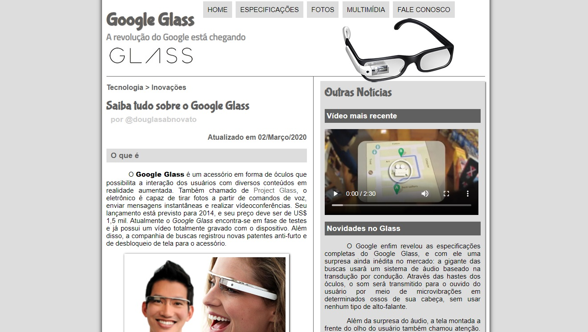

<h4 align="center"> 
	🚧 Google Glass 🚀
</h4> 

<h1 align="center">
    
</h1>

#### Objetivo 

- Desenvolver em HTML CSS e Javascript um site sobre Google Glass, seguindo o projeto de interface conforme as telas do Layout Inspiração.
- [Hospedado em Vercel](https://google-glass.vercel.app/) 

#### Layout Inspiração 

  
  
  
  
  

 

Fonte [Curso em video - Gustavo Guanabara](https://www.youtube.com/watch?v=epDCjksKMok&list=PLHz_AreHm4dlAnJ_jJtV29RFxnPHDuk9o&index=1) 

#### Ferramentas / Tecnologias

- Nessa aplicação temos a noção das mudanças dos padrões das aplicações web que temos hoje como referências. O design e os elementos das metodologias atuais permitem uma intereção com mais fluidez.
- HTML/CSS/Javascript
- Git/Github
- VSCode

---

Feito com ❤️ por 👋🏽
