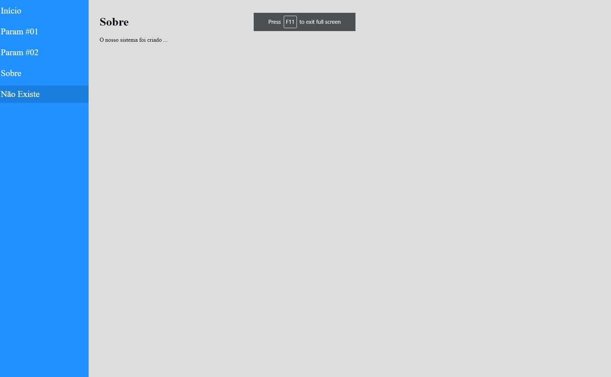

<h4 align="center"> 
	🚧 Navegação React Router 🚧
</h4>   

## 💻 Tarefas para construir calculadora 🚀

- [x] 1. Instalação de dependências
- [x] 2. Criação de Projeto
- [x] 3. Estrutura de Projeto
- [x] 4. Aplicação de estilo
- [x] 5. Navegação simples
- [x] 6. Navegação com Parâmetro
- [x] 7. Parâmetro exact
- [x] 8. Página não encontrada
- [x] 9. Detalhes finais do módulo

## 🎨 Layout

 
   

 

## 🚀 Desafios 

- [x] Layout e lógica [50 - 58] 

## 🚀 Construído projeto 

- `npm i -g create-react-app`
- `create-react-app navagacao-react-router`
- `npm i react-router-dom`
 
## 📝 Licença

Este projeto esta sobe a licença MIT.

Feito com ❤️ por Douglas A B Novato 👋🏽 [Entre em contato!](https://www.linkedin.com/in/douglasabnovato/)
 
Fonte do projeto Por Leonardo Moura Leitão no [Curso React + Redux: Fundamentos e 2 Apps do Absoluto ZERO!](https://www.udemy.com/course/react-redux-pt/)

