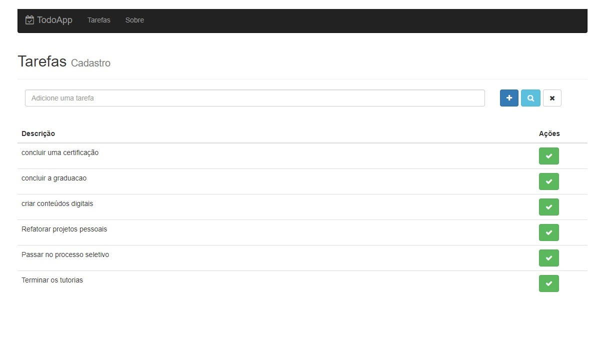

<h4 align="center"> 
	🚧 Todo App 🚧
</h4>   

## 💻 Tecnologias 🚀

- [x] 0. Html, css, javascript
- [x] 1. Express, MongoDB, API Rest, Post Man, Cors, PM2
- [x] 2. ReactJs, Redux, React-Router

## 🎨 Layout

 
    

 

## 🚀 Desafios 

- [x] Construindo o backend com Express [120 - 129] 
- [x] Introdução ao React [130 - 150]  
- [x] Gerenciamento de estado com Redux [151 - 169] 
- [x] Migrando para Redux [170 - 185] 

## 🚀 Inicializar o projeto 

#### Backend

Commands `mkdir backend`. Create file `package.json` with details.   

Install the lib in the development mode: `npm i`.   

Option 1 of Project started nodemon : `mongod` and `npm run dev`.   

Option 2 of Project started pm2 : `mongod` and `npm run production`.   

#### Frontend

Commands `mkdir frontend`. Create file `package.json` with details.   

Install the lib in the development mode: `npm i`.   

Project started nodemon : `npm run dev`.  

## 🚀 Construído projeto 

- [x] 1. Configurar o servidor com express
- [x] 2. Configurar o mongoDB
- [x] 3. Criar requisições com o Postman
- [x] 4. Configurar o Cors
- [x] 5. Rodar o backend com pm2

## 📝 Licença

Este projeto esta sobe a licença MIT.

Feito com ❤️ por Douglas A B Novato 👋🏽 [Entre em contato!](https://www.linkedin.com/in/douglasabnovato/)
 
Fonte do projeto Por Leonardo Moura Leitão no [Curso React + Redux: Fundamentos e 2 Apps do Absoluto ZERO!](https://www.udemy.com/course/react-redux-pt/)

