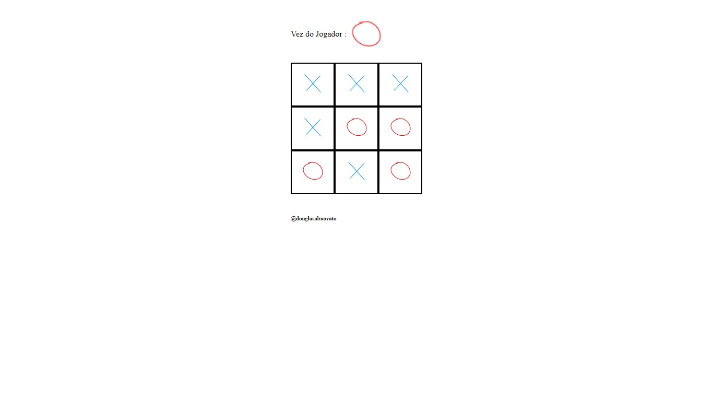

<h3 align="center">
  Jogo da Velha 🚀
</h3>

---

### O que é a aplicação

- Aplicação do jogo da velha construido com código puro.
- 

#### Tecnologias/ Ferramentas/ Bibliotecas

- [Javascript](https://developer.mozilla.org/pt-BR/docs/Web/JavaScript)
- [HTML5](https://developer.mozilla.org/pt-BR/docs/Web/HTML/Element)
- [CSS3](https://developer.mozilla.org/pt-BR/docs/Web/CSS)

#### Código + Dependências

- git clone "http": ter o projeto na máquina local
- Rodar a aplicação: open with Live Server

#### Passo a passo do projeto 

- [x] Montar o tabuleiro do layout do jogo 
- [x] Montar a vez do jogador do layout do jogo
- [x] Controlar os comandos dos jogadores x e o: atualizarMostrador() e inicializarEspacos()
- [x] Controlar quem ganhou: verificarVencedor()

#### Próximo passo na aplicação

- [ ] um botão para jogar de novo
- [ ] informar mensagem que deu velha 

---

- Fonte do projeto: [ProgramadorBR - Criar Jogo da Velha com JavaScript e HTML+CSS ](https://www.youtube.com/watch?v=Ueh549xEV9E&list=PLVzrOYTg7zYD-CYTZN7mufIbV9touYFhq) 
.: Por [Douglas A B Novato](https://linktr.ee/douglasabnovato)
