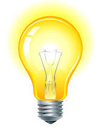
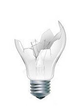

### Uma Lâmpada

#### Objetivo

Uma interação com uma lâmpida a partir do toque do mouse.

#### Ferramentas / Tecnologias

Um projeto de introdução aos elementos web com html, css e javascript.

#### Publicado

- Publicado: [Lâmpada](http://gusty-cattle.surge.sh)
- Lâmpada Acesa    
- Lâmpada Apagada    
- Lâmpada Quebrada    

:. [Linkedin - @douglasabnovato](https://www.linkedin.com/in/douglasabnovato/)
