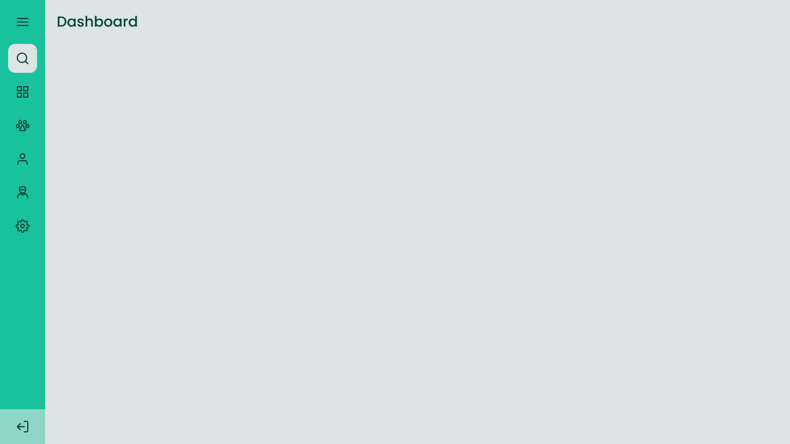

## 💻 Fundamentos

Reunir os conteúdos dos fundamentos dos treinamentos e eventos que eu realizar.

Para apresentar os itens de uma melhor forma, aplicar o desafio Sidebar com os elementos que já constavam nesse repositório.

### 💡 Desafio Sidebar


Neste desafio você deve criar uma sidebar como na imagem acima. Quando o usuário clicar no ícone do menu isso deve fazer com que o estado da sidebar mude entre "aberto", mostrando ícones e texto e "fechado", mostrando apenas os ícones.

### 🚀 Layout


- Consultar o layout do projeto no [figma](https://www.figma.com/file/iOuqAlZvhAMkkfjCMFyc7Y/DD-%2F-Sidebar-Responsiva/duplicate).
- Baixar os assets em `src/assets`
- O layout dos dois estados: sidebar close e sidebar open

<p align="center" style="display: flex; align-items: flex-start; justify-content: center;"> 
   
   
</p> 

### 🚀 Techs

- HTML
- CSS
- JavaScript

### ✅ Construindo o projeto

- [x] Criar uma sidebar que altere o estado entre aberto e fechado conforme o clique do usuário.
- [x] Referências para esse projeto: [O guia estelar de JavaScript](https://app.rocketseat.com.br/node/o-guia-estelar-de-java-script), [Pilotando com a DOM](https://app.rocketseat.com.br/node/pilotando-com-a-dom), [Alinhando os planetas](https://app.rocketseat.com.br/node/flexbox).
- [x] Estilizar o modo sidebar close

### 🎨 Style Guide

- [x] Cores
```css
:root {
  --body-bg-color: #dce4e3;
  --green: #18c29c;
  --light-green: #8ed7c6;
	--light-grey: #dce4e3;
  --text-color: #084236;
}
```
- [x] Tipo de fonte 
- font-family: Poppins 
- font-weight: 400 e 500
- a fonte no [Google Fonts](https://fonts.google.com/) 

### 📅 Buscas no Google

- [como configurar axios na aplicação web html js](https://axios-http.com/docs/intro)
- [como montar uma Responsive SideBar Navigation in HTML CSS & JavaScript](https://www.codinglabweb.com/2021/04/responsive-side-navigation-bar-in-html.html) 
- [como usar a propriedade position em css](https://www.w3schools.com/css/css_positioning.asp)  
- [como centralizar horizontalmente justify-content em CSS](https://developer.mozilla.org/en-US/docs/Web/CSS/justify-content) 
- [como passar para a próxima linha com flexbox](https://desenvolvimentoparaweb.com/css/flexbox-quebrar-proxima-linha-breakline/#:~:text=Como%20quebrar%20linha%20depois%20de%20um%20flex%20item&text=Como%20foi%20dito%2C%20.,pr%C3%B3pria%20linha%20para%20conseguir%20isso)

---

Feito com 💜 por @douglasabnovato 👋 Contato no Linkedin [de portas abertas](https://www.linkedin.com/in/douglasabnovato/)!
