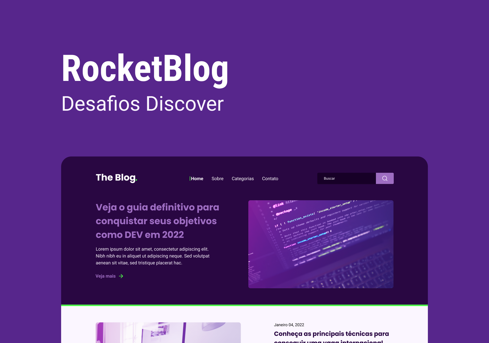

## 💻 Blog

---

Neste desafio você irá desenvolver uma homepage para um blog.

### 💡 Instruções para construir o Layout

---




- Os ícones e imagens para construir o layout estão na pasta `blog/assets`.
- O layout proposto está no [Figma](https://www.figma.com/file/r4CsL6MPTAvE7EvJXjhFK4/DD-RocketBlog/duplicate)

### 🚀 Techs 

---

- HTML
- CSS
- Javascript

### ✅ Requisitos 

---

Neste desafio você vai desenvolver uma homepage para um blog*.A seguir, uma lista dos cursos que podem ajudar a resolver tarefas que serão encontradas.

- [O guia estelar de HTML](https://app.rocketseat.com.br/node/o-guia-estelar-de-html)
- [O guia estelar de CSS](https://app.rocketseat.com.br/node/o-guia-estelar-de-css)
- [Posicionando foguetes](https://app.rocketseat.com.br/node/posicionando-foguetes)
- [Formulários de outro planeta](https://app.rocketseat.com.br/node/formularios-de-outro-planeta)
- [Alinhando os planetas](https://app.rocketseat.com.br/node/flexbox)
- [App bonito, até nos textos](https://app.rocketseat.com.br/node/flexbox)
- [https://css-tricks.com/snippets/css/a-guide-to-flexbox/](https://css-tricks.com/snippets/css/a-guide-to-flexbox/)
- [https://css-tricks.com/snippets/css/complete-guide-grid/](https://css-tricks.com/snippets/css/complete-guide-grid/)

#### Requisitos para o desafio 

- Seguir o layout do Figma.

### 🎨 Style Guide

---

#### Cores 

```css
:root {
  --purple-bg: #290742;
  --dark-bg: #170027;
  --button-bg: #9e6dc2;
  --white: #fff;
  --light-purple: #fbf6ff;
  --green: #4fff4b;
}
```

#### Tipo de fonte 

- font-family: Poppins 
- Font Weight: 700
- font-family: Roboto
- Font Weight: 400 e 700
- Você pode encontrar a fonte no [Google Fonts](https://fonts.google.com/) 

---  

Feito com ❤️ por Douglas A B Novato 👋🏽 [Entre em contato!](https://www.linkedin.com/in/douglasabnovato/)
