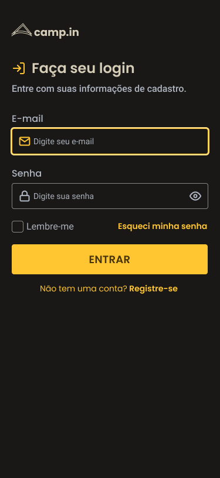
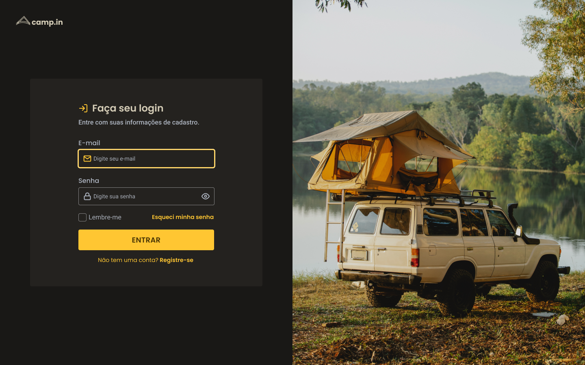
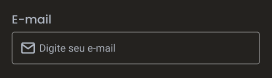
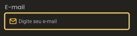
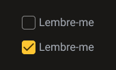

## 💻 Login Form CSS

Neste desafio você vai criar um formulário de login.

### 💡 Instruções para construir o Layout

---




- Os ícones e imagens para construir o layout estão na pasta `login/assets`.
- O layout proposto está no [Figma](https://www.figma.com/file/SX8XFyC5fAY09ai8Oykz0T/DD-%2F-Login-Form---CSS/duplicate) 

### 🚀 Techs 

---

- HTML
- CSS
- Javascript

### ✅ Requisitos 

---

Neste desafio você vai construir *uma página de login para liberar as demais rotas da aplicação além da home. Servindo também para a captação de leads ou newsletter. A seguir, uma lista dos cursos que podem ajudar a resolver tarefas que serão encontradas.

- [O guia estelar de HTML](https://app.rocketseat.com.br/node/o-guia-estelar-de-html)
- [O guia estelar de CSS](https://app.rocketseat.com.br/node/o-guia-estelar-de-css)
- [Posicionando foguetes](https://app.rocketseat.com.br/node/posicionando-foguetes)
- [Formulários de outro planeta](https://app.rocketseat.com.br/node/formularios-de-outro-planeta)
- [Alinhando os planetas](https://app.rocketseat.com.br/node/flexbox)
- [App bonito, até nos textos](https://app.rocketseat.com.br/node/flexbox)
- [:focus-within](https://developer.mozilla.org/pt-BR/docs/Web/CSS/:focus-within)

#### Requisitos para o desafio

- Você deve seguir o layout do Figma
- Os inputs devem ter estilos diferentes dependendo do estado (normal ou em foco)
    - Normal
        
        
        
    - Em foco
        
        
        
    - Checkbox
        
        
        
- Deixar o layout responsivo como exemplo do Figma

### 🎨 Style Guide

---

#### Cores 

Essas são algumas das cores usadas no projeto

```css
:root {
  --text-base: #afb6c2;
  --text-title: #d4ccb6;
  --background: #191816;
  --form-background: #24221f;
  --primary-color: #ffc632;
}
```

#### Tipo de fonte

- font-family: Poppins 
- font Weight: 400, 500 e 600
- font-family: Roboto
- Font Weight: 400 e 500
- Você pode encontrar a fonte no [Google Fonts](https://fonts.google.com/) 

---  

Feito com ❤️ por Douglas A B Novato 👋🏽 [Entre em contato!](https://www.linkedin.com/in/douglasabnovato/)
