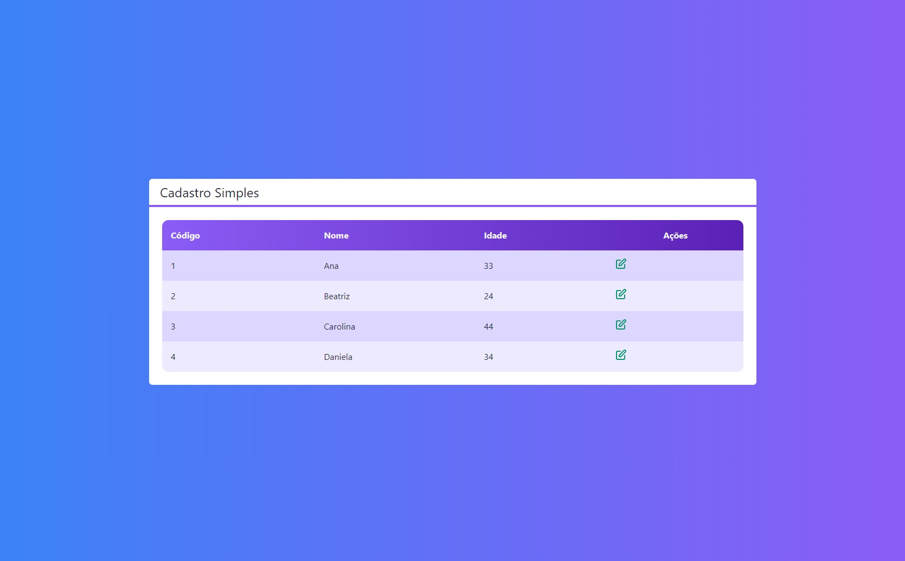
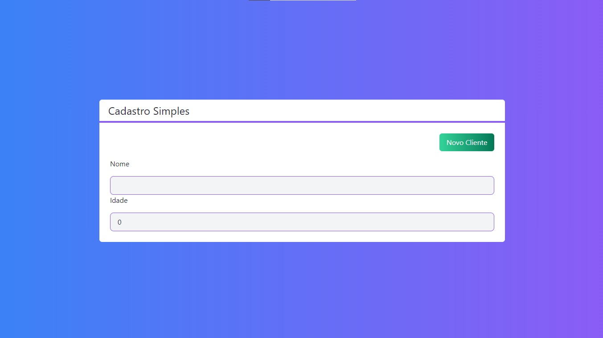

<h4 align="center"> 
	🚧 Cadastro 🚧
</h4>   

## 💻 Tecnologias 🚀

- [x] 0. Html, css, javascript
- [x] 1. Next.JS 
- [x] 2. TailwindCss 
- [x] 3. Firebase Console 

## 🎨 Layout

 
    
   

 

## 🚀 Desafios 

- [x] Introdução a NextJS [81 - 102] 
- [x] Projeto de Cadastro [103 - 119] 

## 🚀 Construído projeto 

- [x] 1. Um crud com Next.JS: `npx create-next-app cadastro`, `cd cadastro` e `npm run dev`
- [x] 2.1. TailwindCss: `npm install -D tailwindcss@latest postcss@latest autoprefixer@latest`
- [x] 2.2. TailwindCss: `npx tailwindcss init -p`
- [x] 3. Firebase Console: criar o bd cloud firebase
- [x] 4. Mudado o formato do index para `tsx`
- [x] 5. Criar o arquivo tsconfig.json
- [x] 6. Instalar `npm install --save-dev @types/react typescript`
- [x] 7. Instalar extensão Tailwind CSS IntelliSense
- [x] 8. Heroicons: ícones edit e trash
- [x] 9. Firebase: `npm install firebase`
- [x] 9.1. Configuração do db - warnings
- [x] 10. Organizando código com Hooks
- [x] 11. Firestore deletado devido a informações sensíveis
## 📝 Licença

Este projeto esta sobe a licença MIT.

Feito com ❤️ por Douglas A B Novato 👋🏽 [Entre em contato!](https://www.linkedin.com/in/douglasabnovato/)
 
Fonte do projeto Por Leonardo Moura Leitão no [Curso React + Redux: Fundamentos e 2 Apps do Absoluto ZERO!](https://www.udemy.com/course/react-redux-pt/)

