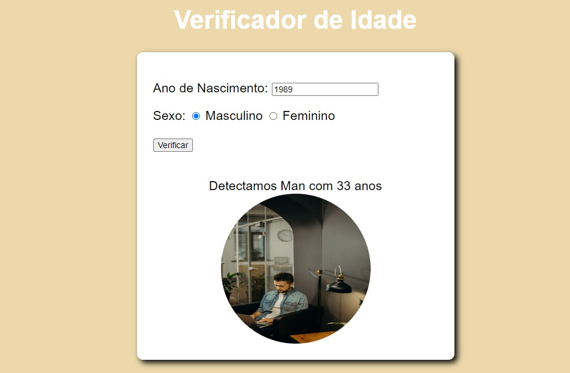
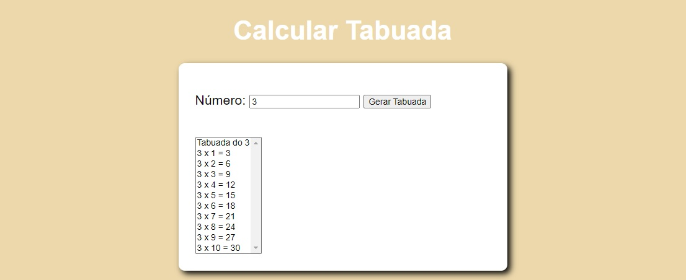
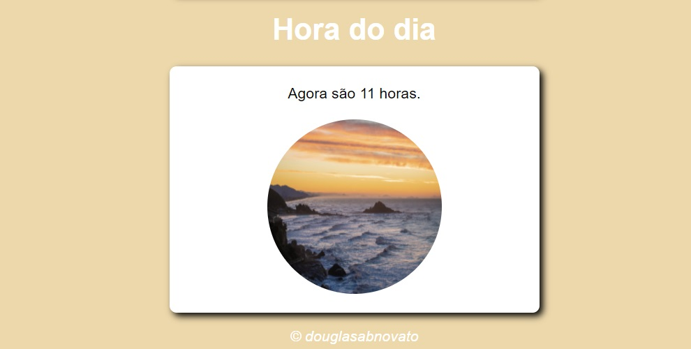
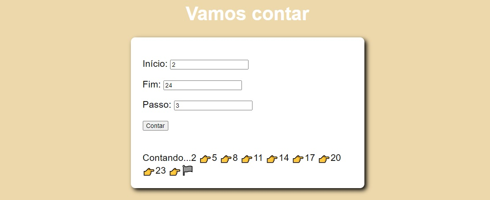

<h4 align="center"> 
	🚧 Dev JS 🚀
</h4> 

<h1 align="center">
    
</h1>

### Introdução aos Fundamentos do Javascript

- [x] tarefa 1 - Calcular Tabuada
- [x] tarefa 2 - Vamos contar
- [x] tarefa 3 - Verificador de Idade
- [x] tarefa 4 - Hora do dia

### Layout

- [Hospedado](https://dev-ojxqwoybu-douglasabnovato.vercel.app/)

  
  
  
  

 
