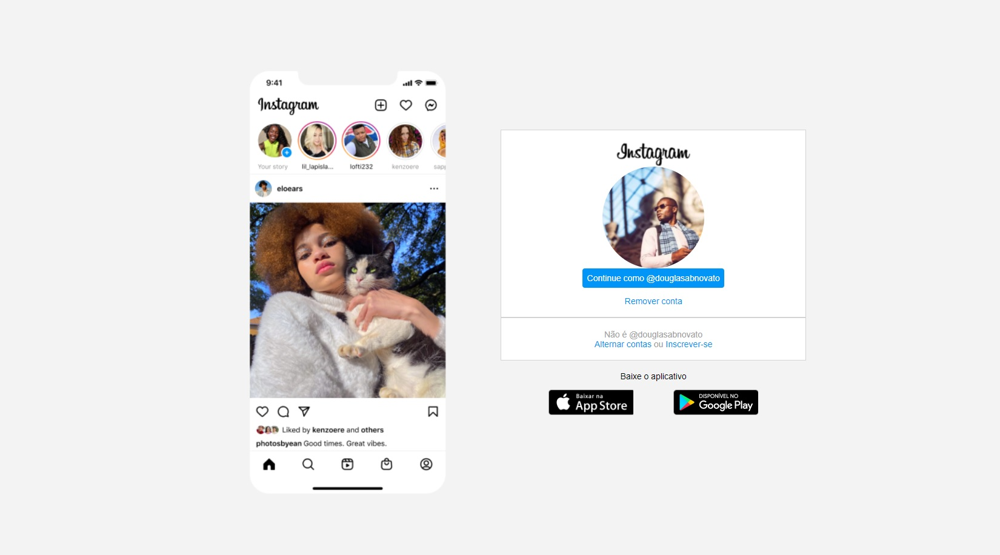
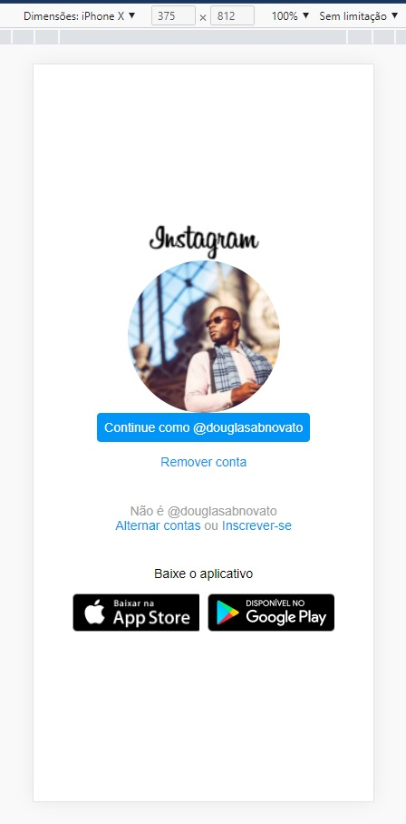

### 💻 Desafio Projeto

- Recriar a página inicial do Instagram em quatro etapas
- Parte 1: estrutura do html
- Parte 2: estilização do css
- Parte 3: estilização do css
- Parte 4: estilização do css
- Design modelo

  
  

- Resultado do projeto

  
  
  

- Para isso, é recomendado o uso de CSS com Flexbox, uma das abordagens de posicionamento de elementos mais utilizadas quando se trata de responsividade.
