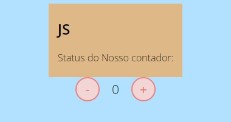

### Contador

Projeto da prática de resolver problema com js.

#### Tarefas da prática

1. Tente implementar os eventos usando o método `addEventListener`. 
2. Crie condicionais que desabilitam o botão de incrementar ou decrementar quando `count` chegar a um determinado valor *(ex.: 0 <= count =< 10)*.
3. Mudar a cor para vermelho ou para azul conforme o valor do current.

#### Solução da prática

- Solução

