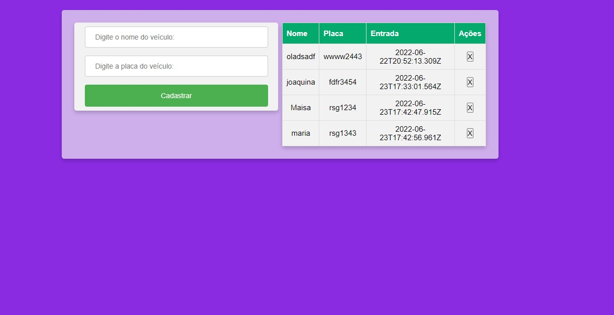

### Prática

Desafio de Projeto para desenvolver um estacionamento com typescript. 

- crud de estacionamento
- adicionar funcionalidades
- [x] layout responsivo
- [x] design responsivo
- [x] design do input info 
- [x] design da tabela

