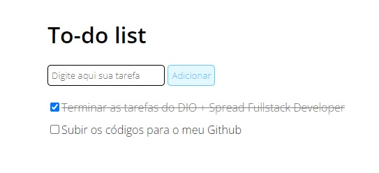

### To-do list

Projeto da prática de resolver problema com js.

#### Tarefas da prática

1. Crie um campo de `input` de texto e um botão para adicionar a tarefa à lista;
2. Quando o botão for pressionado, o texto deve aparecer na lista com um `checkbox` ao lado;
3. Quando o usuário selecionar o checkbox, o item correspondente deve ficar com o texto riscado. _(ex.: ~~tarefa completa~~. dica: você pode resolver isso facilmente com CSS)_
4. Template Inspiração

#### Solução da prática

- Solução

