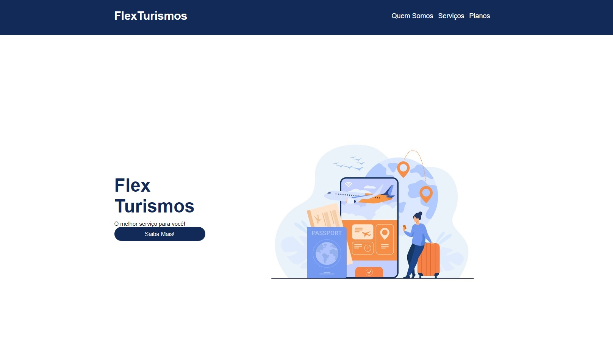
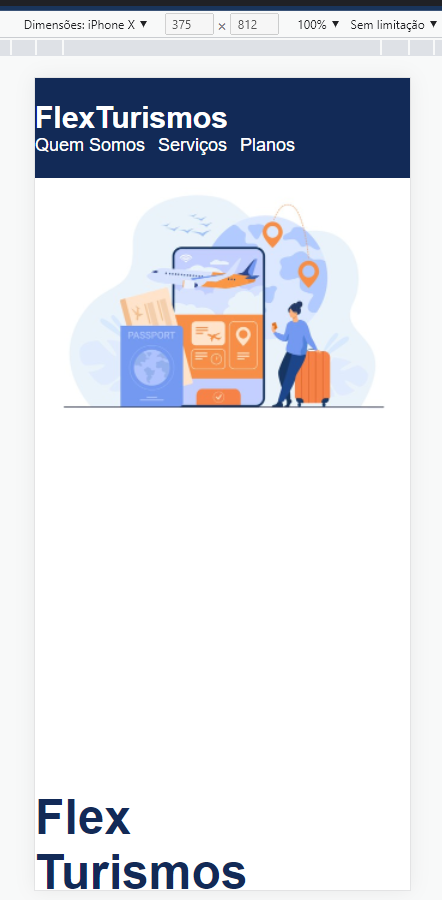
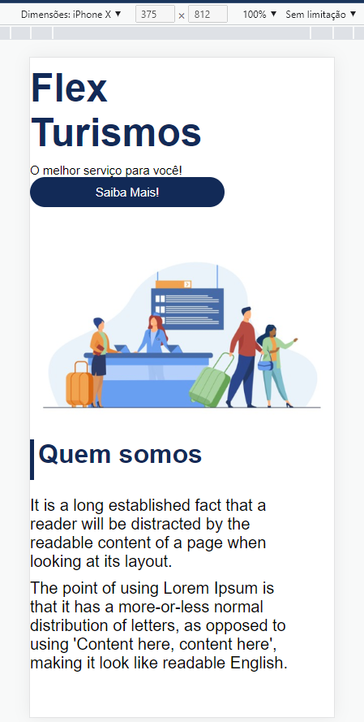
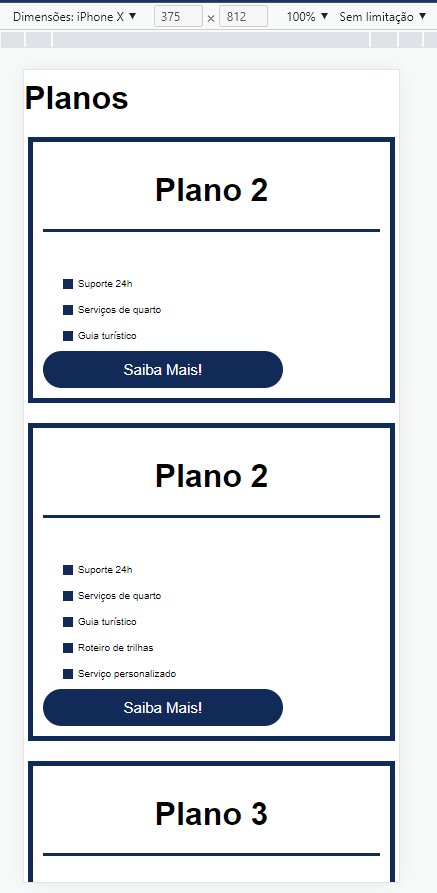
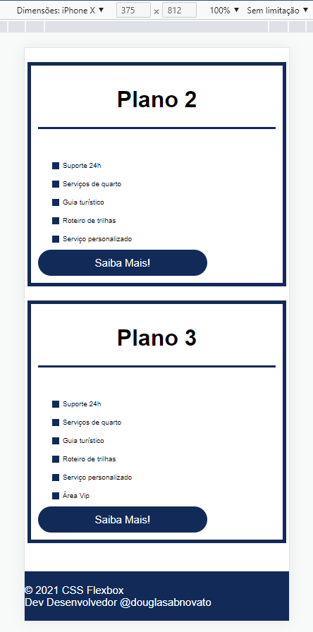
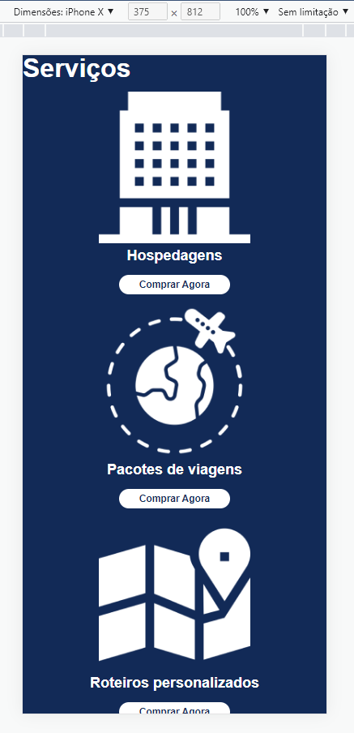
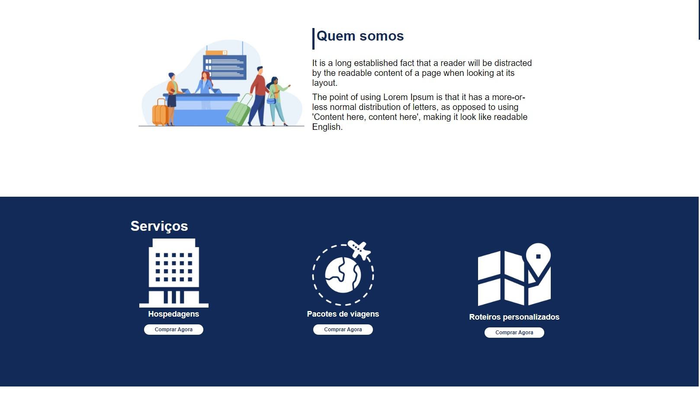
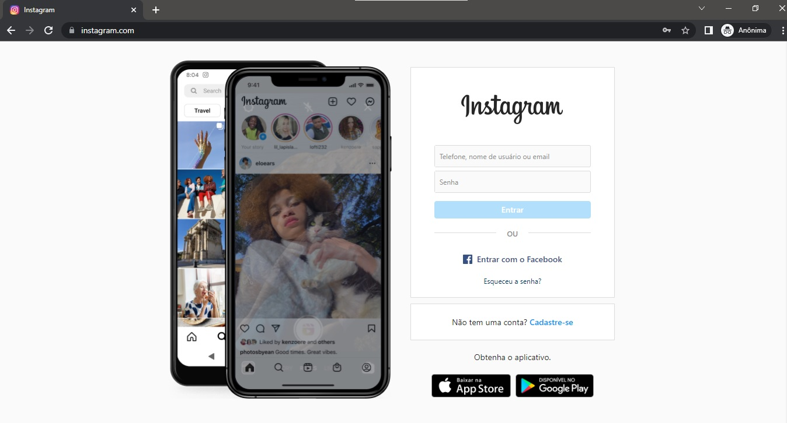
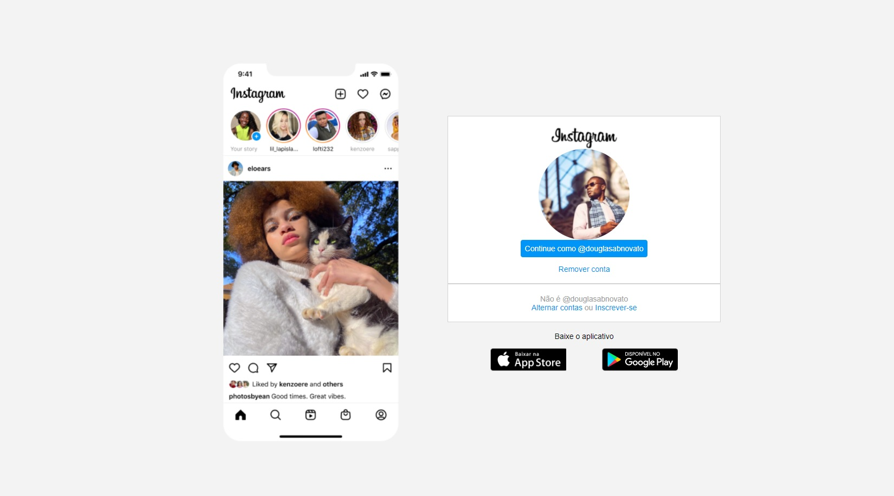
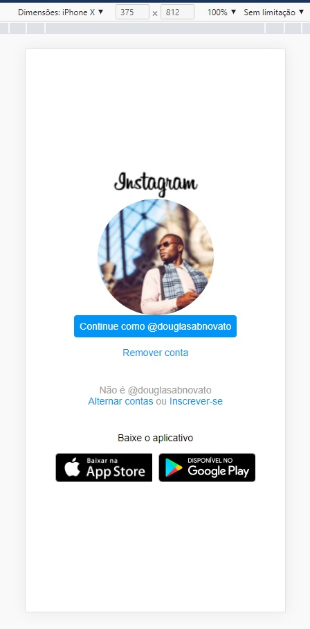

### 💻 Detalhes do Bootcamp

---  

Desenvolvendo os Desafios frontend do bootcamp Spread Fullstack Developer da DIO.
 
### 💻 Módulo I

---  

Uma tarefa foi a criação do repositório, testando alguns dos comandos aprendidos no curso introdução ao git e ao github do módulo I - conteúdo de abertura.

- [x] comandos no git bash
- `git init`
- `git status`
- `git add .`
- `git status`
- `git commit -am "inicializando projeto"`
- `git status`
- `git remote add origin git@github.com:douglasabnovato/dio-spread-dev.git`
- `git branch -M main`
- `git push -u origin main`

### 💻 Módulo II

---  

No curso "Posicionando elementos com flexbox em css", criar elementos html para dominar o posicionamento em tela com recursos do css.

- [x] html semântica
- [x] css
- `display: flex`
- `flex-direction: row`
- `flex-direction: row-reverse`
- `flex-direction: column`
- `flex-direction: column-reverse`
- `flex-wrap: nowrap`
- `flex-wrap: wrap`
- `flex-flow`
- `justify-content`
- `align-items`
- `align-content`
- `flex-grow`
- `flex-basis`
- `flex-shrink`
- `flex: grow, shrink, basis`
- `order: number`
- `align-self`

#### 🛠 Construindo Projeto Prático

---  

Projeto prático para experimentos o conteúdo dos fundamentos do css.

<h3 align="center"> 
	🚧 Flex Turismos 🚀
</h3> 

<h1 align="center">
    
</h1>

#### 💻 Sobre o projeto

---

- Desenvolver um site para divulgar a agência de turismos com html, css e javascript.
- Seguir o paradigma mobile first para desenvolver o layout.

#### 🚀 Techs

---

- HTML
- CSS
- JavaScript

#### Versão 2 - Flex Turismos Mobile

- ajustado alguns detalhes na media query na dimensão 992px
- Construindo a aplicação em versões.
<p align="center" style="display: flex; align-items: flex-start; justify-content: center;">  
   
   
  
  
  
</p>

#### Versão 1 - Flex Turismos

- estrutura html e os assets
- unidade de medida flexíveis
- em: leva em consideração o setado do pai
- rem: font-size base de 16px
- rem: base de cálculo das medidas 10px - 0.625rem; 12px - 0.75rem; 14px - 0.875rem; 16px - 1rem; 18px - 1.125rem
- estratégia para facilitar os cálculos:
````css
html{ font-size: 62.5%; } 
h1{ font-size: 1.2rem; }
````
- Construindo a aplicação em versões.
<p align="center" style="display: flex; align-items: flex-start; justify-content: center;">  
   
   
  
</p>

#### 😯 Finalizado 

---  

- Construindo a aplicação em versões.
<p align="center" style="display: flex; align-items: flex-start; justify-content: center;">  
  
</p>

#### 🧭 Adicionado

---  

- Hospedado no Github Pages em Versões

#### 💻 Próximo passo

---  

- Criar uma variação desse layout
- Adicionar novas seções, como a de depoimentos.

### 💻 Desafio Projeto

- Recriar a página inicial do Instagram em quatro etapas
- Parte 1: estrutura do html
- Parte 2: estilização do css
- Parte 3: estilização do css
- Parte 4: estilização do css
- Design modelo
<p align="center" style="display: flex; align-items: flex-start; justify-content: center;">  
  
</p>
- Resultado do projeto
<p align="center" style="display: flex; align-items: flex-start; justify-content: center;">  
  
  
</p>
- Para isso, é recomendado o uso de CSS com Flexbox, uma das abordagens de posicionamento de elementos mais utilizadas quando se trata de responsividade.

### 💻 Módulo III

---  

Atividade prática do curso variáveis e tipos para reforçar o conteúdo em javascript.

- [x] verificar palíndromo: solução I e solução II
- [x] substituir números pares

Atividade prática do curso funções para reforçar o conteúdo em javascript.

- [x] array
- [x] this

Atividade prática do curso coleções para reforçar o conteúdo em javascript.

- [x] maps 
- [x] sets

Desafio de Código: desafios iniciais JS spread fullstack developer feitos na plataforma online semelhante ao Hacker Rank. 

Desafio de Projeto: criar um projeto de estacionamento com typescript. 

### 💻 Módulo IV

---  

Atividades práticas em reactjs

### 💻 Módulo V

---  

Atividades práticas em banco de dados

### 💻 Módulo VI
 
--- 

Atividades práticas em nodejs
 
--- 

Feito com ❤️ por Douglas A B Novato 👋🏽 [Entre em contato!](https://www.linkedin.com/in/douglasabnovato/)
