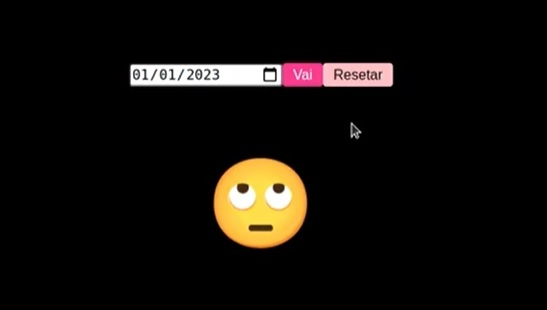
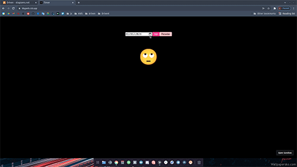
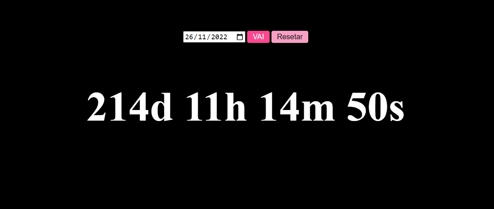

<h1 align="center">
    
</h1>

<h4 align="center"> 
	🚧 Date Stopwatch 🚀
</h4> 

### 💻 Sobre o projeto

- Desenvolver um cronômetro online salvando dados no navegador com html, css e javascript.
- Utilizar o template do layout a seguir para construir.

  
  

- O fluxo da aplicação é a seguinte:

  

- Inspiração: Desafio da Driven em construir aplicações com os fundamentos de js, html e js em um espaço curto de tempo.

### 🛠 Construindo 

- A estrutura html
- A estilização css
- A lógica de cálculo de datas em javascript
- O botão resetar para retornar o h1 e limpar esse contador
- Fazer a chamada para a função para um efeito cronômetro
- Apagar o processo de contador
- Usar o localstorage para memorizar o contador 
- Usar o localstorage para resgatar o contador 
- Usar o localstorage para limpar o contador 

### 😯 Finalizado 

- Terminamos o segundo desafio da driven. Dessa vez, com um pouco mais complexidade na lógica da aplicação. Vamos para o próximo.

  
  

### 🧭 Adicionado

- Editando os elementos html para tags semânticas

### 💻 Próximo passo

- aperfeiçoar o layout do cronômetro aplicando princípios de ux. 
- responsividade
- acessibilidade
- modo dark / light
- variação de cores

---  

Feito com ❤️ por Douglas A B Novato 👋🏽 [Entre em contato!](https://www.linkedin.com/in/douglasabnovato/)
