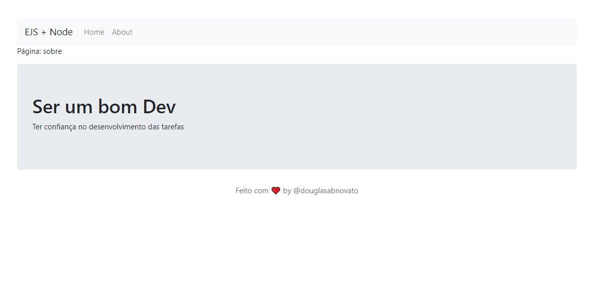

<h4 align="center"> 
	🚧 EJS + NodeJS 🚀
</h4> 

### Desafio do projeto

Esse projeto possui os fundamentos de node com ejs com a criação de uma página formada por um menu, paginação, views com partials e o mais interessante que é consumir informações de um objeto e então, criar elementos html com ejs.

### O Projeto

- [x] Criar o HTML
- [x] Criar o servidor Express
- [x] Seperar as partes do Layout
- [x] Nova página e Menu
- [x] Views e partials - Organização
- [x] Passando um objeto para o EJS
- [x] ForEach: percorre o objeto e gera o Html

### + Detalhes

- `npm init -y`
- Bootstrap 
- `npm install ejs`
- `npm install express` 
- importação por `<%- include('../partials/head'); %>`

### Rodar o Projeto

- `npm start`
- rota: `http://localhost:8080/sobre`

### + From

Criado a partir do treinamento da Rocketseat da trilha Discover > NodeJS + EJS: HTML inteligente.

### Layout

