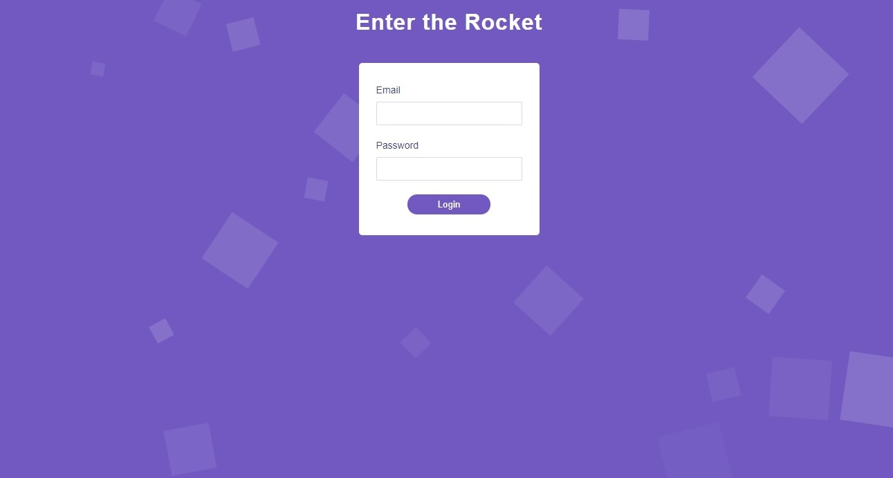

<h1 align="center">
    
</h1>

<h4 align="center"> 
	🚧 Formulário de Login  🚀 em construção... 🚧
</h4> 

<p align="center">
  
  
  <a href="https://www.twitter.com/douglasabnovato/">
    
  </a>
</p>

## 💻 Sobre o projeto

♻️ Formulário de Login 

Um formulário de login com design animado criado com js puro e css animation, com 8 propriedades de Animation:

- animation-name: animationname;
- animation-duration: 2s;
- animation-delay: 3s;
- animation-fill-mode: none;
- animation-play-state: running;
- animation-timing-function: ease;
- animation-direction: reverse;
- animation-iteration-count: infinite;
 
## 🎨 Layout

- [x] 1. Fazer o formulário aparecer, suavemente, quando a página abrir
- [x] 2. Fazer os campos aparecem da esquerda pra direita, suavizando a entrada e fazendo-os entrar em momentos distintos
- [x] 3. Quando clicar em Login, fazer o formulário sair da tela, indo para baixo
- [x] 4. Remover formulário do html e não mostrar rolagem enquanto o formulário está saindo da tela
- [x] 5. Adicionar um efeito diferente de timing para a saída do formulário
- [x] 6. Fazer o formulário dizer não-não (vibrar) caso haja campos vazios.
- [x] 7. Criar alguns quadrados animados (que fiquem girando) e que saem de baixo da tela (fora do campo de visão) e vão para cima da tela (que saia do campo de visão também). _Detalhes_: Deve ter tamanhos diferentes, sairem em momentos diferentes, terem timing diferente, animação contínua.

### Web - v1.0

<p align="center" style="display: flex; align-items: flex-start; justify-content: center;">
   
</p>

## 🛠 Tecnologias

Uma aplicação web responsiva, desenvolvida em html, css e javascript.

- [Css][css]
- [Javascript][javascript]
- [HTML][html]
- [Git][git]
- [Github][github] 
- [CSS Animation Docs](https://developer.mozilla.org/en-US/docs/Web/CSS/CSS_Animations/Using_CSS_animations)<br/>
- [Animation Timing Docs](https://developer.mozilla.org/en-US/docs/Web/CSS/animation-timing-function)<br/>
- [Site para criar animações](http://animista.net/play/basic/scale-up)<br/>
- [Site para criar cubic Bézier timming](https://matthewlein.com/tools/ceaser)

## 🚀 Como executar o projeto

Podemos considerar este projeto como sendo com uma parte:
1. Front End (pasta web)  

### Pré-requisitos

Antes de começar, você vai precisar ter instalado em sua máquina as seguintes ferramentas: [Git](https://git-scm.com), [Node.js][nodejs]. 
Além disto é bom ter um editor para trabalhar com o código como [VSCode][vscode].

### 🧭 Rodando a aplicação web (Front End)

```bash
# Clone este repositório
$ git clone https://github.com/douglasabnovato/formulario-login

# Acesse a pasta do projeto no seu terminal/cmd
$ cd formulario-login 

# Execute a aplicação em modo de desenvolvimento
Open Live Server no arquivo index.html

# A aplicação será aberta na porta:3000 - acesse http://localhost:3000
```

## 😯 Como contribuir para o projeto

1. Faça um **fork** do projeto.
2. Crie uma nova branch com as suas alterações: `git checkout -b my-feature`
3. Salve as alterações e crie uma mensagem de commit contando o que você fez: `git commit -m "feature: My new feature"`
4. Envie as suas alterações: `git push origin my-feature`
> Caso tenha alguma dúvida confira este [guia de como contribuir no GitHub](https://github.com/firstcontributions/first-contributions)


## 📝 Licença

Este projeto esta sobe a licença MIT.

Feito com ❤️ por Douglas A B Novato 👋🏽 [Entre em contato!](https://www.linkedin.com/in/douglasabnovato/)

[git]: https://git-scm.com/doc
[github]: https://docs.github.com/en
[nodejs]: https://nodejs.org/
[typescript]: https://www.typescriptlang.org/
[expo]: https://expo.io/
[reactjs]: https://reactjs.org
[rn]: https://facebook.github.io/react-native/
[yarn]: https://yarnpkg.com/
[vscode]: https://code.visualstudio.com/
[vceditconfig]: https://marketplace.visualstudio.com/items?itemName=EditorConfig.EditorConfig
[license]: https://opensource.org/licenses/MIT
[vceslint]: https://marketplace.visualstudio.com/items?itemName=dbaeumer.vscode-eslint
[prettier]: https://marketplace.visualstudio.com/items?itemName=esbenp.prettier-vscode
[rs]: https://rocketseat.com.br 
[css]: https://developer.mozilla.org/en-US/docs/Web/CSS 
[html]: https://developer.mozilla.org/en-US/docs/Web/HTML
[javascript]: https://developer.mozilla.org/en-US/docs/Web/JavaScript 

Fonte: De [Mayk Brito | Formulário Animado com JS puro e CSS Animation](https://www.youtube.com/watch?v=GykTLqODQuU)