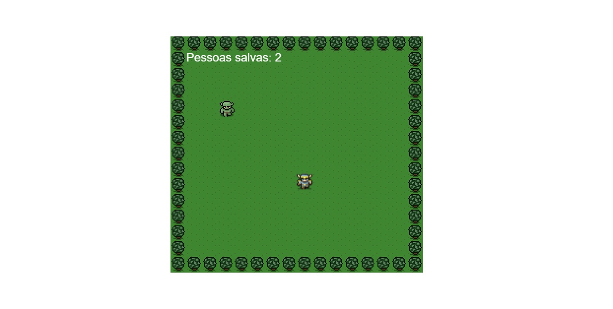

<h3 align="center">
  Jogo Lost Decade 🚀
</h3>

--- 

### O que é a aplicação

- Tela de login em reactjs
- com validação de campos usando métodos do javascript
- 

#### Código + Dependências

- projeto na pasta local 
- npm install
- Rodar a aplicação: `npm run babel`
- Abrir aplicação: open with Live Server

#### Tecnologias/ Ferramentas/ Bibliotecas

- [x] 1. Estrutura HTML
- [x] 2. Funcionalidades com JS
- [x] 3. Estilização CSS 
- [x] 4. Babel
- [x] 5. Renderizar o Jogo

---

- Fonte do projeto: [Estevan Maito](https://www.youtube.com/channel/UCIUOmAsotrzdK8VsZuHfVHw) e [Lost Decade Game](http://www.lostdecadegames.com/how-to-make-a-simple-html5-canvas-game/)
.: Por [Douglas A B Novato](https://linktr.ee/douglasabnovato)
