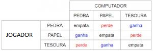
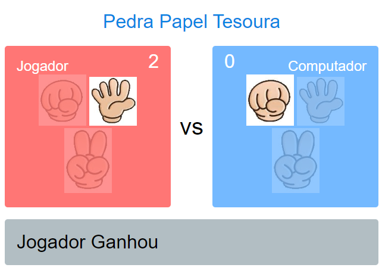

### Jogo Pedra Papel e Tesoura

#### Objetivo

Criar uma aplicação web representando o famoso e tradicional jogo pedra, papel e tesoura com  HTML, Css e JS, sem auxílio de biblioteca, com o objetivo de programar a mão.
Esse jogo tem uma lógica de funcionamento conforme a tabela a seguir, para programar a combinação do jogador. 
A criação dessa aplicação foi pensada em desktop mas pode ser usada em mobile pois seu funcionamento é possível com touch.

-  

#### Ferramentas / Tecnologias

- HTML/CSS/Javascript
- Git
- Github
- VSCode

#### Publicado
 
- Publicado: [Jogo Pedra, Papel e Tesoura](http://game-pedra-papel-e-tesoura.surge.sh/)
- Hospedado no Servidor Surge.sh
- 

:. [Linkedin - @douglasabnovato](https://www.linkedin.com/in/douglasabnovato/) 
.. De [Felipe Fontoura - Canal Dev Samurai](https://www.youtube.com/watch?v=JP3eYU137t8&t=15s)
