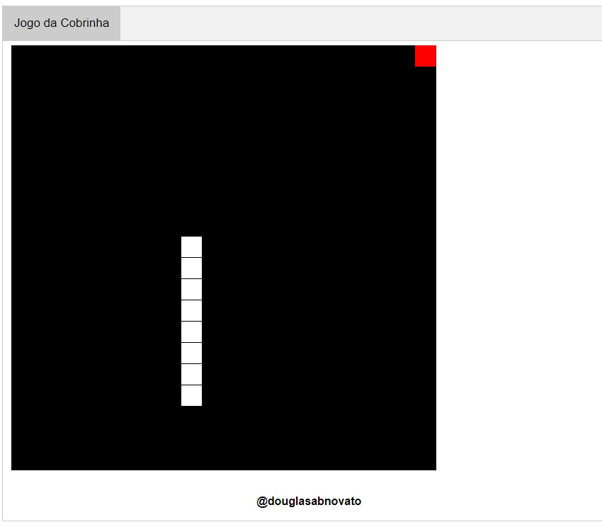

### Jogo da Cobrinha (snake game)

#### Objetivo

O famoso e tradicional jogo da cobrinha. 
Os elementos do jogo são a cobrinha, a maçã e o tabuleiro.

#### Ferramentas / Tecnologias

Uma aplicação desktop desenvolvida em Javascript. 
Usando um menu tabs com CSS e JavaScript.

#### Publicado

- Publicado: [Jogo da Cobrinha](https://douglasabnovato.github.io/snake-game/)
- 

:. [Linkedin - @douglasabnovato](https://www.linkedin.com/in/douglasabnovato/) 
.. de : [Programador BR](https://www.youtube.com/watch?v=Hua1OSXitdQ&list=WL&index=16&t=54s)
