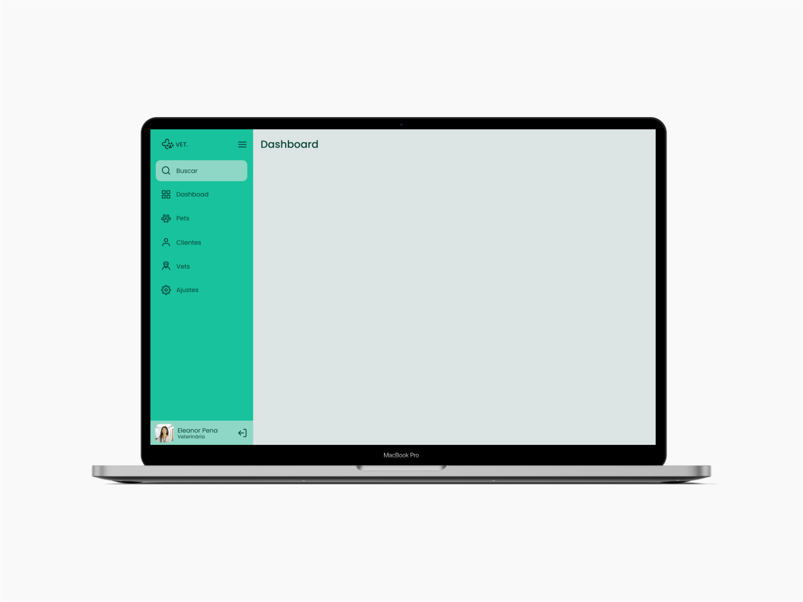
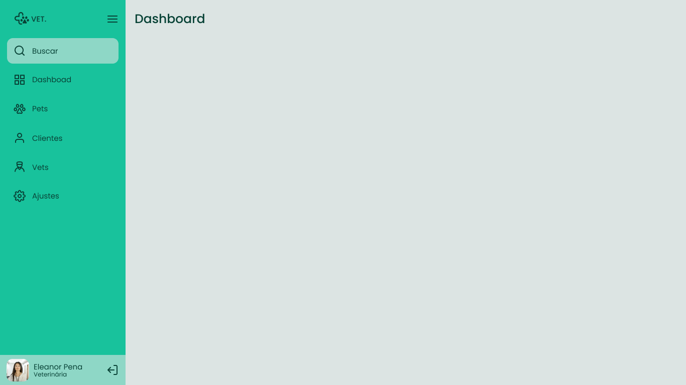

## 💻 Sidebar

utilizado o projeto sidebar que está no meu repositório fundamentos.

### 💡 Detalhes do Layout 🚀 

Neste desafio você deve criar uma sidebar como na imagem acima. 
Quando o usuário clicar no ícone do menu isso deve fazer com que o estado da sidebar mude entre "aberto", mostrando ícones e texto e "fechado", mostrando apenas os ícones.


- Baixar os assets em `src/assets`
- O layout dos dois estados: sidebar close e sidebar open

<p align="center" style="display: flex; align-items: flex-start; justify-content: center;"> 
   
   
   
</p> 

### 🎨 Style Guide

- [x] Cores
```css
:root {
  --body-bg-color: #dce4e3;
  --green: #18c29c;
  --light-green: #8ed7c6;
	--light-grey: #dce4e3;
  --text-color: #084236;
}
```
- [x] Tipo de fonte 
- font-family: Poppins 
- font-weight: 400 e 500
- a fonte no [Google Fonts](https://fonts.google.com/)  
 
